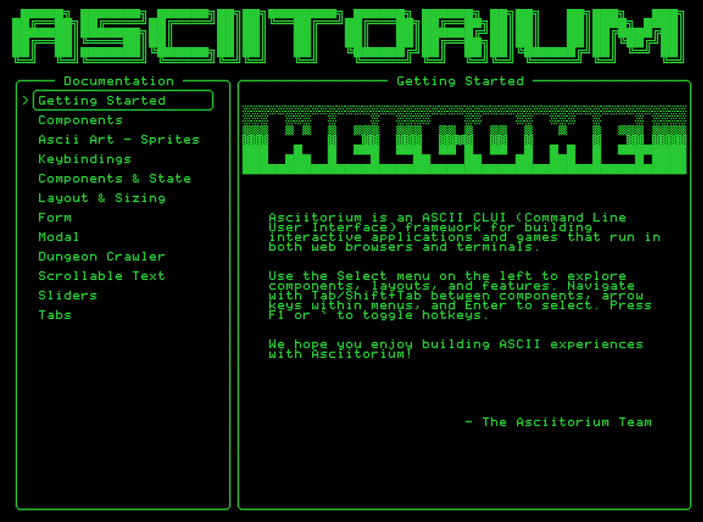

# asciitorium

**asciitorium** (pronounced ASS-kee-TOR-ee-um, unlike plane-a-rium seen [here](https://youtu.be/oK5n9lPvaQk?feature=shared&t=5), is an ASCII-only framework that runs in both the web and terminal. It was designed to create CLUIs (Command Line User Interfaces), and having a web build component speeds development. Originally it was purposed to allow a Gen Xer to build games to the flavor of Wizardy I, Zork, etc. but frankly has gotten out of hand.



```jsx
import {
  App,
  Component,
  Text,
  State,
  AsciiArt,
  TextInput,
  CelticBorder,
  HR,
} from 'asciitorium';

const helloWorld = new State('Hello, World!');
// Load ASCII art from public/art directory
const titleArt = 'Your ASCII Art Here';

const app = (
  <App width={64} height={20} layout="aligned">

    <Component align="top" layout="column" gap={2}>
      <AsciiArt content={titleArt} align="top" />
      <HR length={48} align="center" />
      <Text value="a ui framework for cli and web" align="top" gap={3} />
    </Component>

    <TextInput width={30} value={helloWorld} gap={5} align="bottom" />

    <Text width={24} align="bottom" gap={2}>
      {helloWorld}
    </Text>

  </App>
);

await app.start();
```

## Key features

- **Cross-platform**: Runs similarly in web browsers and terminals
- **Responsive**: Auto-detects screen size and supports percentage-based sizing
- **Zero dependencies**: Lightweight with no runtime dependencies
- **TypeScript**: Full TypeScript support with custom JSX runtime
- **Component-based**: Supports JSX and React-like component architecture

## Getting Started

### Create New Project (Recommended)

The fastest way to get started is with the project scaffolder:

```bash
npm create asciitorium@latest my-app
cd my-app
npm install
npm run web  # or npm run cli
```

This creates a complete project with examples, TypeScript configuration, and both web and CLI support.

### NPM Installation

Add asciitorium to an existing project:

```bash
npm install asciitorium@latest
```

### CDN Usage (Zero Setup)

For quick prototyping or browser-only usage without npm:

```html
<script type="module">
  import {
    App,
    Text,
    Button,
  } from 'https://unpkg.com/asciitorium/dist/asciitorium.es.js';

  const app = (
    <App width={40} height={10}>
      <Text align="center">Hello from CDN!</Text>
      <Button align="center" gap={{ top: 2 }}>
        Click Me
      </Button>
    </App>
  );

  await app.start();
</script>
```

Alternative CDN providers:

- **unpkg**: `https://unpkg.com/asciitorium/dist/asciitorium.es.js`
- **jsDelivr**: `https://cdn.jsdelivr.net/npm/asciitorium/dist/asciitorium.es.js`

## Built-in Components

### Core Components

- **App** - Root application container with screen detection and rendering management
- **Component** - Base component class with positioning, borders, focus handling, and layout support
- **Fragment** - Container for grouping child components without additional rendering

### Layout Components

- **Row** - Horizontal layout container for arranging components side-by-side
- **Column** - Vertical layout container for stacking components

### Input Components

- **Button** - Interactive clickable button with focus indicators and press effects
- **TextInput** - Text input field with cursor navigation and keyboard handling
- **Select** - Single-selection dropdown list with keyboard navigation
- **MultiSelect** - Multi-selection list allowing multiple item selection
- **Switch** - Conditional rendering component for dynamic content switching
- **Tab** - Individual tab component for tabbed interfaces
- **TabContainer** - Container managing multiple tabs with keyboard navigation

### Display Components

- **Text** - Static and dynamic text display with word wrapping and alignment
- **Art** - ASCII art display component for images and animations
- **Maze** - Interactive ASCII maze with player movement and collision detection
- **PerfMonitor** - Real-time performance monitoring display

### UI Elements

- **HR** - Horizontal rule/divider line
- **VR** - Vertical rule/divider line
- **CelticBorder** - Decorative Celtic-style border elements
- **Sliders** - Collection of slider components (ProgressBar, Gauge, Dot, Vertical)

### State Management

- **State<T>** - Reactive state management with subscribe/unsubscribe pattern
- **PersistentState<T>** - State management with localStorage persistence

## Styling Components

All components support both individual styling properties and a consolidated `style` prop for cleaner code organization.

### Style Property

Use the `style` prop to group related styling properties using either the style object, individual jsx properties, or both (individual props take precedence).

```tsx
// Using style prop
<Text style={{ width: 40, align: 'center', gap: { bottom: 2 } }}>
  Hello World
</Text>

// Using individual props (takes precedence over style prop)
<Button width={30} align="center" border>
  Click Me
</Button>
```

### Available Style Properties

- **width** / **height** - Size values (number, percentage, 'auto', 'fill')
- **border** - Show border around component
- **background** - Fill character for component background
- **align** - Alignment ('left', 'center', 'right', 'top', 'bottom', etc.)
- **position** - Positioning coordinates object `{ x?: number, y?: number, z?: number }` (enables absolute positioning)
- **gap** - Spacing around component (number or object with top/bottom/left/right)
- **visible** - Component visibility (State<boolean> for reactive show/hide)

### Component Visibility

Components support reactive visibility control through the `visible` prop, which accepts a `State<boolean>` for dynamic show/hide functionality:

```tsx
const showModal = new State(false);

// Component is hidden when showModal.value is false
<Component visible={showModal}>Modal content here</Component>;

// Toggle visibility
showModal.value = true; // Show component
showModal.value = false; // Hide component
```

### Absolute Positioning

Components can use absolute positioning to override the layout system and position themselves at specific coordinates:

```tsx
// Modal positioned at specific screen coordinates
<Component
  position={{ x: 10, y: 5 }}
  border
>
  Modal content positioned absolutely
</Component>

// Using style object
<Component
  style={{
    position: { x: 10, y: 5 },
    border: true
  }}
>
  Modal content
</Component>

// With z-index layering
<Component
  position={{ x: 10, y: 5, z: 10 }}
  border
>
  Modal content with high z-index
</Component>
```

**Key Features:**

- **Overrides layout**: Components with `position` property ignore parent layout algorithms
- **Absolute coordinates**: x/y values are relative to the screen, not parent
- **Perfect for overlays**: Modals, tooltips, and floating elements
- **Z-index layering**: Control stacking order with the z property

### Focus Indicators

Leaf components display context-appropriate focus indicators when focused, typically using `>` and `<` characters, providing clear visual feedback for keyboard navigation while maintaining elegant design.

### Keyboard Navigation

asciitorium provides keyboard navigation for all focusable components:

#### Navigation Keys

- **Tab** - Move focus to the next focusable component
- **Shift+Tab** - Move focus to the previous focusable component

#### Hotkey System

Components can be assigned explicit hotkeys for instant access:

```tsx
<Button hotkey="u" onClick={handleUpdate}>Update</Button>
<Button hotkey="c" onClick={handleCancel}>Cancel</Button>
```

- **F1** or **`** (backtick) - Toggle hotkey visibility
- **[Letter Key]** - Jump directly to component with that hotkey

When hotkey visibility is enabled, components display their assigned keys in brackets (e.g., `[S]` for Save button) at position (1,0) within their boundaries.

#### Component-Specific Controls

- **Button** - Enter/Space to activate
- **TextInput** - Standard text editing with cursor navigation
- **Select/MultiSelect** - Arrow keys for navigation, Enter to select
- **TabContainer** - Arrow keys to switch between tabs
- **Sliders** - Arrow keys to adjust values
- **Maze** - Arrow keys or WASD for player movement

## 🛠 Development

This repo uses **npm** workspaces.

### Available Scripts

This monorepo provides several npm scripts for development, building, and testing.

#### Root Level Scripts (from repository root)

```bash
# Development
npm run web      # Start the core library demo in web mode (vite dev server)
npm run cli      # Run the core library demo in CLI/terminal mode

# Building
npm run build    # Build all packages in the workspace

# Testing & Release
npm run test     # Run full test suite (scaffolding + web demo)
npm run version  # Update version numbers across all packages
npm run release  # Publish all packages to npm
```

## 📂 Monorepo Structure

```bash
packages/
├──asciitorium/        # The core UI framework
└──create-asciitorium/ # CLI to scaffold new projects
package.json           # Root scripts and workspace configuration
```

## 📝 Changelog

See [CHANGELOG.md](CHANGELOG.md) for detailed release notes and migration guides.

## 📄 License

This repository is licensed under the MIT License. See the [LICENSE](packages/asciitorium/LICENSE) file for details.
